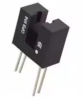

# mosfet arduino avancé

## Objectif et fonctionnalités
réaliser un mosfet sur base d’arduino, reprogrammable et open source. Il intégrera les fonctions suivantes pour ça première version :

- précocking
- surveillance de la tension de la batterie
- configuration via bluetooth
- afficheur 7 segments x 4
- modes de tirs configurables
- active breaking
- sauvegarde des paramètre même hors tension

Les éléments à mettre en place pour les fonctionnalités sont détaillés ci-après.

### Précocking & modes de tir

Il faut pour cela détecter les cycles du moteur/pistons. On utilisera un capteur de type photodiode(ou phototransistor) + led IR comme illustré, pour détecter la course du tappet plate.

On colle une petite pièce sur le tappet plate qui viendra occulter le capteur en fin de course.

Ce type de capteur se récupère très facilement sur des imprimantes hors d’usage.
Pour l’utiliser il suffit d’alimenter la led IR en 5v avec une résistance de 220 ohm et de connecter le - de la photodiode à la masse et l’autre sur une entrée arduino qui sera configurée en INPUT_PULLUP.

> Note : l'utilisation du precocking est extrèmement efficace sur la réactivité du tir mais une chute de fps peut être apercu sur la première bille ou sur le long terme. Pensez à bien décompresser le ressort après utilisation (voir uncocking)

### Surveillance de la batterie

On utilise un pont diviseur pour abaisser la tension prise sur la batterie à un niveau compris entre 0 et 5v et on lira cette valeur sur une entrée analogique.
Tension maximale d’une batterie d’airsoft : 15v
Facteur à atteindre : ⅓
Nous choisiront une résistance de 200k coté VCC et 100K coté GND nous multiplions le résultat lu par 3 pour obtenir le voltage réel.
Note : la tension chute fortement lorsque le moteur est en route, il faut (je suppose) prendre en compte cette tension pour la protection de la batterie et pas juste la tension hors utilisation.

### Configuration via bluetooth

On utilise un module bluetooth type hc-05 ou hc-06 (hc-06 dans notre cas mais le câblage et l’usage est identique) en faisant bien attention à diminuer la tension par un pont diviseur (5v ers 3.3v) depuis l’arduino vers la broche Rx du module.
Coté code, le module communique en série avec l’arduino et lui envoie toute les donnée reçu par le téléphone (de la même manière qu’avec l’usb). On utilisera la bibliothèque SoftwareSerial au lieu de relier le module sur les broche tx et rx de l’arduino car cela semble poser des problème lors de la mise à jour des sketchs.

### Active breaking

On utilise un couple de transistors mosfet N et P selon un montage précis (pompé sur les internets). Le circuit renvoie le courant généré par le moteur lors de sa mise hors tension et lui ré-injecte à l’inverse, ce qui provoque un arrêt plus rapide.
Sauvegarde des paramêtres
Pour sauver les paramètre même lors de la mise hors tension on utilise la mémoire EEPROM de l’arduino.

## Circuit électronique

Une version simple du circuit électronique est visible ici
https://www.tinkercad.com/things/6ycemaio86j-arduino-mosfet
à noter que la connexion du HC-06 et de l'afficheur 7-segments n'est pas détaillée.

### matériel
section à remplir

## Code arduino

Le code arduino est disponible sur github à l’adresse suivante :
https://github.com/simonjamain/airsoft-advanced-arduino-mosfet

#### dépendances

le sketch dépend de la bibliothèque **Pushbutton (by Pololu)** trouvable sur le gestionnaire de bibliothèque d'arduino ou manuellement [ici](https://github.com/pololu/pushbutton-arduino)

il utilise également les deux bibliothèque modifiés suivantes :

- https://github.com/simonjamain/Grove_4Digital_Display
- https://github.com/simonjamain/CmdArduino

pour installer les bibliothèques manuellement, clonez les dépots dans votre dossier de bibliothèques arduino (méthode préférée), sinon, suivez [ce guide (anglais)](https://www.arduino.cc/en/guide/libraries#toc2) ou [ce guide (francais)](https://knowledge.parcours-performance.com/librairies-arduino-installer/#methode_manuelle)

## utilisation

### première utilisation

Avant le premier tir vous devez initialiser la configuration du mosfet.

*section à compléter*

### modes de tir
Le passage entre les différents modes de tir ce fait grâce a une pression sur le **multimodeButton**.

- **SAFE** : détente désactivée
- **MODE 1** : nombre de coups et type de cycle déterminé par configuration
- **MODE 2** : nombre de coups et type de cycle déterminé par configuration

la configuration et l'uncocking via bluetooth sont disponible depuis tout les modes de tir.

### configuration (via bluetooth)
*section à remplir*
### precocking
*section à remplir*

## améliorations futures

- nettoyage du code et notamment des header (y compris des bibliothèques)
- retrait des bouts de codes concernant la detection du sélécteur de tir qui brouille le code (matériellement pas en place pour le moment)
- réglage du nombre de modes de tir
  - gestion différente et plus dynamique des modes de tir
- calcul automatique des meilleures valeures de precocking
  - gestion intelligente des timings precocking en fonction du voltage ?
- commande d'initialisation des config via bluetooth